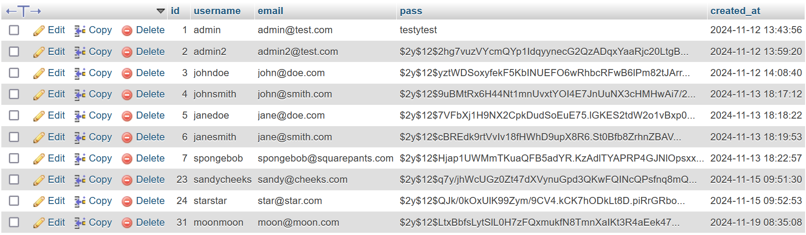
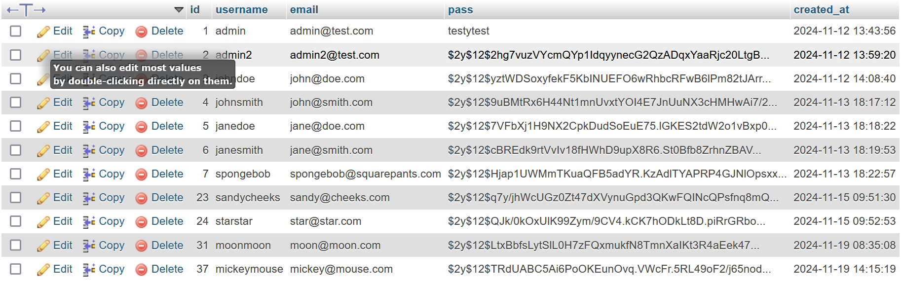
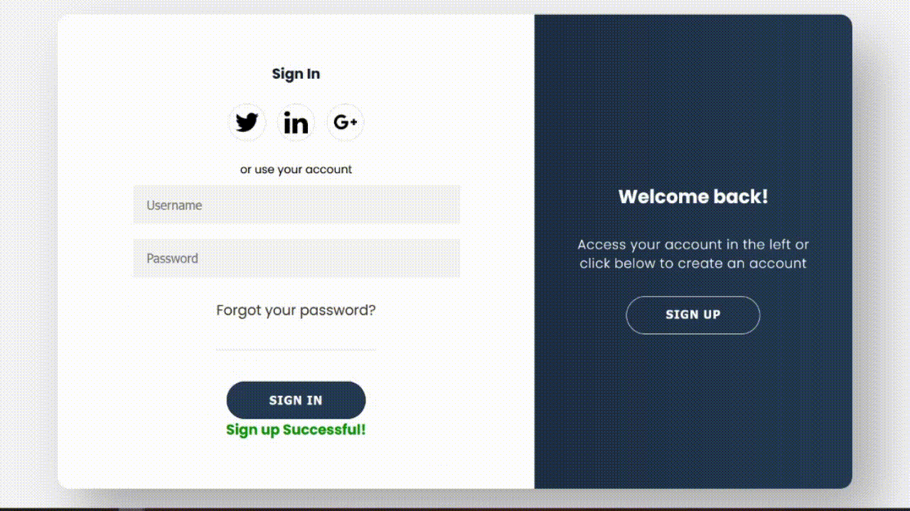
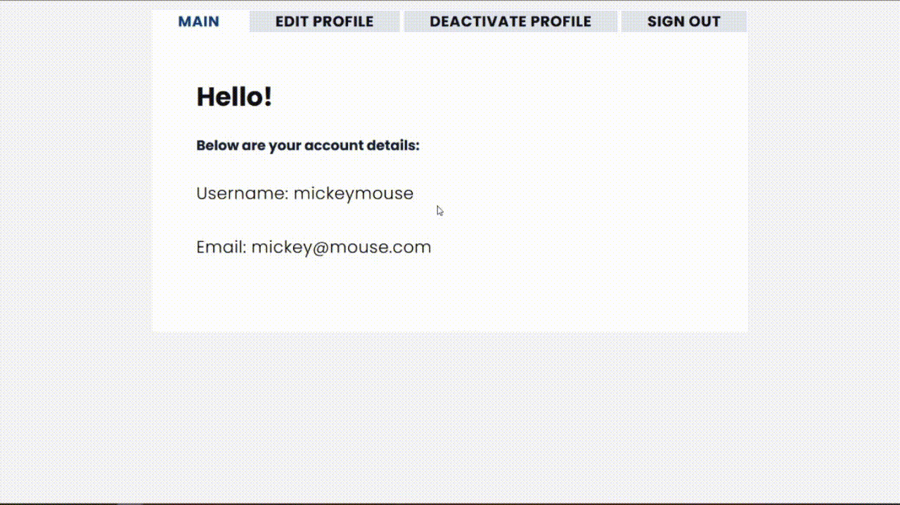
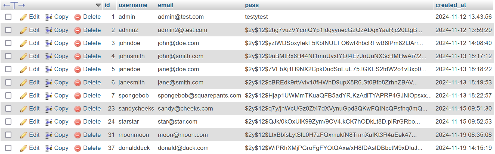
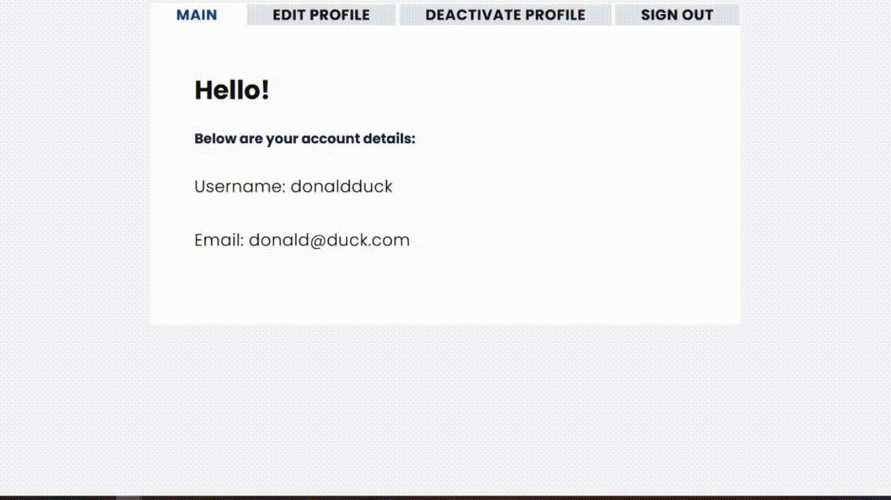
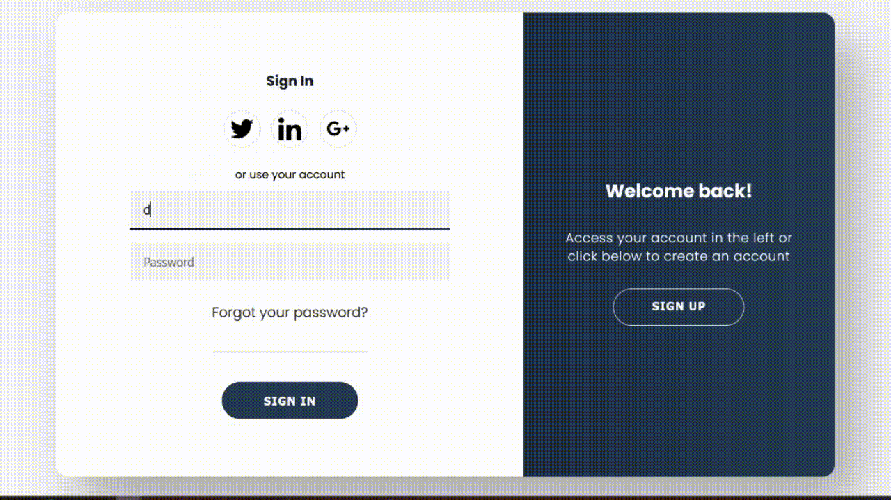
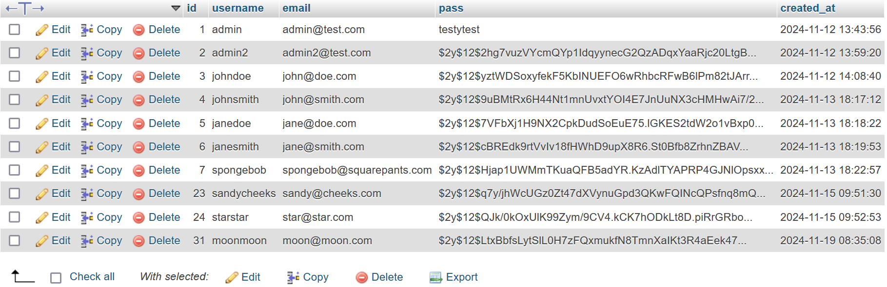

# Registration/Login - PHP

Another basic PHP CRUD project. It's a simple registration and login project that utilizes MySQL.

<hr>

### How It's Made:

**PHP**

- Manually created table in MySQL
- Connected PHP with MySQL via PDO method (db.php).
- Registration (Saving Data)
  - Created PHP that when the input box are filled, it is saved into MySQL when submit is clicked.
  - validator file makes sure all fields are filled with respective error messages.
  - Password is hashed.
- Logging In (Verifying Data(?))
  - validator validates that username and password are exist in MySQL, with respective error messages.
  - Prevents access to index page.
- Index (Displaying Data)
  - Displays username and email upon login.
  - Prevents access to Registration and Login page.
- Update
  - Allows users to change their username, email, and password

**CSS/SASS**

- Implemented SASS styling the login-registration page.

**JavaScript**

- Created script that enables toggling of class in order to implement an animation.
- Created script that allows a "panel" to be visible and hide all other panel.
- Added an alert on deactivation of account (deletion of data).

<hr>

Quickstart MySQL Query:

```
CREATE TABLE users (
    id INT(11) NOT NULL AUTO_INCREMENT,
    username VARCHAR(30) NOT NULL,
    email VARCHAR(30) NOT NULL,
    pass VARCHAR(100) NOT NULL,
    created_at DATETIME NOT NULL DEFAULT CURRENT_TIME,
    PRIMARY KEY (id)
);
```

<hr>

### Demo:

The screenshot of the data below are the data before creating the account. <br>
Notice that the last data is moonmoon with id 31.


Below is a demo of the registration process showing error messages until a successful account creation.

<p align="center">

</p>

After a successful registration, the data is saved into the database. <br>
Notice that the last data is now mickeymouse with id 37.


The demo below is the login process after the registration. <br>
It also displays the possible error messages one may encounter before making a successful login.
<br>
After logging in, it will display the username and email on the main home page.

<p align="center">

</p>

Below is a demo of the update function. <br>
It would allow one to update their username, email, and password. <br>
In the end, you would notice that the username and email in the home page reflects the new changes.

<p align="center">

</p>

After a successful update, the data in the database is updated. <br>
Notice that the last data is now donaldduck BUT the id is still 37.


After updating the data, the demo below demonstrate the sign out funtion.

<p align="center">

</p>

After signing out, the demo below shows that the new username is used to sign in. <br>
After a signing in, it demonstrates account deletion. <br>

<p align="center">

</p>

As per the demo above, the user was redirected to the login page after the account deletion, and an attempt to re-sign in will result an error as the username no longer exist. <br><br>
Below is the database after the account was deleted. <br>
As per the image below, the last username is now moonmoon with id 31.


## Tech used:


